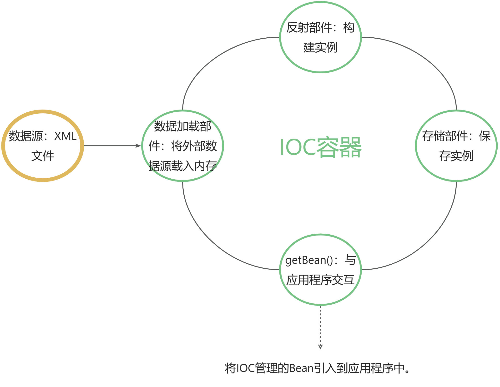

    <h1>SeedSpring</h1>

    <small><b>造轮子项目：从头实现Spring框架</b></small>

   

### 项目介绍

> Spring 是 java 开发的平台，我们常说的 java 编程，其实是在Spring框架上做开发。因此作为专业程序员，深度理解 Spring Framework 是很必要和重要的。对 Spring 这个基础框架的理解，能让我们**以不变应万变，把握住技术快速流变中相对稳定的内核**。

### 系统设计
#### IOC结构

#### SeedSpring 实现了一个简易版本的 Spring 框架，实现了其四大核心部分：IOC容器、MVC、JDBCTemplate 以及 AOP

* 通过**反射**实现了以xml文件为数据源创建Bean，实现了构造器和setter注入，并放入容器中进行管理
* 实现成员变量**依赖注入**：支持**配置或注解**的方式进行Bean的依赖注入，并**解决循环依赖**问题
* 通过“接口抽象类”模式**增强代码的可复用性与框架的可扩展能力**
* 构建 DispatcherServlet (承担请求处理的功能)，**整合IOC与MVC**，实现Tomcat启动时同时启动IOC容器
* **解耦MVC**独立出请求处理器并用一个**简洁统一的注解方式自动注册映射关系**来定位要调用的方法
* 实现MVC传入参数的**自动绑定**，并引入RequestParam注解实现**指定参数绑定**
* 实现ModelAndView(将处理结果返回给前端)，**分解**出MessageConverter、ViewResolver和View三个部件，可**自由实现具体场景**
* 利用**Servlet 机制、MVC 结构、IoC 容器、RequestHandler 和数据绑定**等功能，确保前后台的有效沟通和良好的交互体验，实现一个高效可靠的 Web 应用程序
* 通过**模板化+Callback模式+IoC容器**简化了数据库操作；抽出数据源概念，包装connection，分割应用程序与数据库(解耦:更灵活地切换和管理不同的数据库;统一管理:简化了应用程序代码中与数据库连接相关的繁琐和重复的工作)
* **设计实现SQL语句配置化并实现动态数据源配置**
* 使用**JDK动态代理技术**实现了AOP，并进行了解耦，采用 IoC 容器来管理代理对象，实现了**非侵入式编程**
* **结构化**动态添加的逻辑（引入(Advice：增强操作)和(Interceptor：增强逻辑)的概念，从而实现软件结构化，完全解耦）
* 实现了代理方法的**通配形式**以及**自动化生成动态代理**，便于**统一处理**
